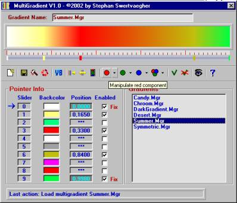



## MultiGradient V1\.0

### Description

This prog produces a multiple gradient (max. 10 colors) with different pointers. The colors and the pointers can be saved. Together with the sub (called Multigrad) and two functions (GetFirst and GetLast), you can have a multigradient in your own application. If you find any bugs, please let me know. Suggestions are welcome. See screenshot. Have fun !...
 
### More Info
 

             |
---                |---
**Submitted On**   |2002-04-27 00:58:06
**By**             |[stephane swertvaegher](https://github.com/Planet-Source-Code/PSCIndex/blob/master/ByAuthor/stephane-swertvaegher.md)
**Level**          |Intermediate
**User Rating**    |5.0 (25 globes from 5 users)
**Compatibility**  |VB 6\.0
**Category**       |[Complete Applications](https://github.com/Planet-Source-Code/PSCIndex/blob/master/ByCategory/complete-applications__1-27.md)
**World**          |[Visual Basic](https://github.com/Planet-Source-Code/PSCIndex/blob/master/ByWorld/visual-basic.md)
**Archive File**   |[MultiGradi762724262002\.zip](https://github.com/Planet-Source-Code/stephane-swertvaegher-multigradient-v1-0__1-34146/archive/master.zip)

